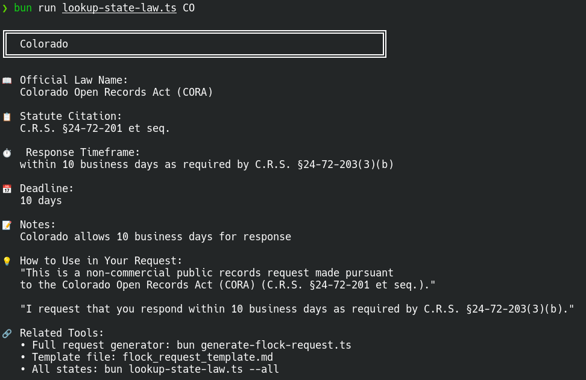

# Flock Safety Public Records Request Tools

Tools to help citizens exercise their legal right to request public records about Flock Safety surveillance systems in their communities.

## 🎯 Purpose

Government surveillance systems should be transparent and accountable to the communities they serve. This project makes it easier for citizens to request public information about Flock Safety automated license plate reader (ALPR) cameras using proper legal citations for each state.

## ⚡ Quick Start



### For Tech-Savvy Users (Command Line)

The scripts run on [Bun](https://bun.sh), a free JavaScript/TypeScript runtime (it runs the `.ts` scripts directly, no build step) — one-line install:

```bash
# macOS / Linux
curl -fsSL https://bun.sh/install | bash

# Windows (PowerShell)
powershell -c "irm bun.sh/install.ps1 | iex"
```

**No Bun? No problem** — skip down to the [copy-paste template](#for-everyone-copy-paste-template) below; it requires nothing.

```bash
# Clone the repository
git clone https://github.com/rpriven/flock-public-records-toolkit
cd flock-public-records-toolkit

# Quick lookup: What's my state's law?
bun lookup-state-law.ts CO

# Run the interactive generator
bun generate-flock-request.ts

# Follow the prompts to generate your request
```

### For Everyone (Copy-Paste Template)

If you're not comfortable with command-line tools:

1. Open `flock_request_template.md`
2. Find your state's legal citations in the reference section
3. Copy the template and fill in your information
4. Send to your local agency

### Coming Soon: Web App

A browser-based version — **no download, no install**. Pick your state and fill in the agency + your contact details; it builds a records request with the correct state legal citations and deadlines, ready to copy or download. **Runs entirely in your browser — your information is never sent, stored, or logged anywhere.** *(In progress.)*

---

## 📂 What's Included

### Interactive Scripts

**`lookup-state-law.ts`** (Quick Reference) ⚡
- Instant state statute lookup
- Shows correct legal citations for your state
- No dependencies — one command to run (requires Bun, see Quick Start)
- Usage: `bun lookup-state-law.ts <STATE_CODE>`

**`generate-flock-request.ts`** (Interactive Generator) 🔒
- Security-hardened with input validation
- Prevents path traversal and injection attacks
- Validates email addresses and ZIP codes
- Generates state-specific requests
- Safe for public use

### Templates & Documentation

**`flock_request_template.md`**
- Copy-paste ready template
- State-by-state legal reference guide
- Best practices and tips for success

---

## 💡 Why We Built This

The original community template was a great starting point, but we identified opportunities to improve accuracy and accessibility:

✅ **State-specific citations**: Each state has different laws and response timeframes
✅ **Correct terminology**: Using proper names (not "FOIA" for state requests)
✅ **Automation**: Interactive tools reduce manual work
✅ **30-day urgency**: Highlighting Flock's automatic data deletion
✅ **Multi-state support**: 20 states with accurate legal citations

**This toolkit builds on community efforts to make public records requests more accessible and legally accurate.**

---

## 🗺️ State Coverage

Currently supports **20 states** with accurate legal citations:

- Arizona (AZ)
- California (CA)
- Colorado (CO)
- Florida (FL)
- Georgia (GA)
- Illinois (IL)
- Massachusetts (MA)
- Maryland (MD)
- Michigan (MI)
- Nevada (NV)
- New Mexico (NM)
- New York (NY)
- North Carolina (NC)
- Ohio (OH)
- Oregon (OR)
- Pennsylvania (PA)
- Tennessee (TN)
- Texas (TX)
- Virginia (VA)
- Washington (WA)

**Don't see your state?** You can still use the generic template or contribute your state's information (see Contributing section below).

---

## ⏱️ Critical: 30-Day Data Deletion

**Flock Safety automatically deletes all camera data after 30 days** on a rolling basis.

**This means:**
- You have ~30 days from when footage was captured to request it
- Delays in agency response can result in permanent data loss
- Always request expedited processing
- Follow up immediately if delayed

**Our templates include expedited processing requests to address this issue.**

---

## 📋 What These Requests Will Get You

### ✅ Likely to Receive

- **Contracts and pricing** - Public agencies must disclose
- **Policies and procedures** - Generally public records
- **Meeting minutes** - Required to be public in most states
- **Financial records** - How public money is spent
- **Training materials** - Usually not exempt

### ⚠️ May Require Legal Challenge

- **Actual camera footage** - Privacy exemptions sometimes claimed
- **Your own vehicle data** - Strongest legal argument for access
- **Other people's vehicle data** - Usually denied on privacy grounds

### 🏆 Recent Legal Wins

Courts are increasingly ruling that Flock data is subject to public records laws:
- **Virginia 2025**: Cardinal News won case for Flock footage
- **Washington 2025**: Judge ordered police to release surveillance data
- **General principle**: Public records law trumps vendor contracts

---

## 💡 Tips for Success

### 1. **Act Quickly**
Flock deletes data after 30 days. File your request ASAP and request expedited processing.

### 2. **Request Your Own Vehicle Data**
If you want specific footage, request data about YOUR OWN vehicle. This has the strongest legal backing.

Example: *"All images and data for license plate ABC-1234 (my vehicle, 2020 Honda Civic) from January 1-15, 2025."*

### 3. **Use State-Specific Language**
Never use "FOIA" for state/local requests. Use your state's specific law name.

### 4. **Request Electronic Format**
Usually faster and often free or cheaper than paper copies.

### 5. **Follow Up in Writing**
Document all communications. If they miss the deadline, send a written follow-up citing the specific statute.

### 6. **Know Your Appeal Rights**
Most states have administrative appeals processes. Be prepared to appeal denials.

### 7. **Fee Waivers May Apply**
Many states waive fees for public interest requests, media requests, or non-commercial use.

---

## 🛡️ Legal Disclaimer

This tool generates templates for public records requests that are explicitly authorized by state and federal law. Public records requests are a constitutionally protected right under the First Amendment and state sunshine laws.

### This Tool Does NOT:
- Perform hacking or unauthorized access
- Bypass security measures
- Violate any laws or regulations
- Collect or transmit user data

### This Tool DOES:
- Help citizens exercise their legal right to access public records
- Provide accurate legal citations for state public records laws
- Generate properly formatted request letters
- Support government transparency and accountability

### Intended Use

Educational purposes and to assist citizens in exercising their legal rights to request public records under applicable state laws.

### Not Legal Advice

This tool provides templates and information, not legal advice. For specific legal questions about your request, consult an attorney familiar with your state's public records law.

---

## 🤝 Contributing

Want to help expand this tool?

### Add Your State

If your state isn't supported, you can add it:

1. Look up your state's public records law statute
2. Find the mandated response timeframe
3. Add entry to the `STATE_LAWS` object in `generate-flock-request.ts`

Example:
```typescript
XX: {
  name: "Your State",
  lawName: "Your State Public Records Act",
  statute: "State Code §XXX.XXX et seq.",
  responseTime: "within X days as required by State Code §XXX.XXX",
  specificTimeframe: X, // or null if no specific deadline
  notes: "Additional notes about your state's law"
}
```

### Report Issues

Found an error in legal citations? Please open an issue with:
- Which state
- What's incorrect
- Correct citation/information
- Source for verification

### Share Success Stories

Filed a request using these tools? Let us know how it went! Success stories help others understand what to expect.

---

## 📚 Additional Resources

### Research & FOIA Tracking
- **MuckRock** - FOIA tracking and examples: https://www.muckrock.com
- **DocumentCloud** - Document analysis and sharing
- **National Freedom of Information Coalition**: https://www.nfoic.org/

### Legal Background
- Each state has its own public records law (not "FOIA")
- Federal FOIA (5 U.S.C. § 552) only applies to federal agencies
- State laws generally favor disclosure with specific exemptions
- Public records law typically trumps vendor contracts

### Digital Rights Organizations
- **Electronic Frontier Foundation (EFF)**: https://www.eff.org
- **ACLU**: https://www.aclu.org
- **Fight for the Future**: https://www.fightforthefuture.org

---

## 🔒 Security & Privacy

### Our Security Practices

- **Input validation** on all user inputs
- **Path traversal prevention** for file operations
- **No data collection** - everything runs locally
- **No network calls** - completely offline
- **Open source** - audit the code yourself

### For Your Safety

- Run scripts in a safe directory
- Review generated letters before sending
- Don't include sensitive information beyond what's required
- Keep copies of all correspondence

---

## 📜 License

MIT License - See LICENSE file for details

This is free and open-source software. You are free to use, modify, and distribute it.

---

## 💬 Questions or Feedback?

- **Issues**: Open an issue on GitHub
- **Discussions**: Use GitHub Discussions for questions
- **Community**: Check the Clippies Zulip or your local privacy advocacy groups

---

## 🙏 Acknowledgments

- **Louis Rossmann and Repair.org** - Started the Flock opposition movement with Denver investigation
- Original template from Clippies Zulip community
- Legal research from state government websites and NFOIC
- Inspired by MuckRock, ACLU, and other transparency advocates
- Built with Bun and TypeScript

### Relationship to Louis Rossmann's Denver Investigation

This project **complements** Louis Rossmann's Denver-specific investigation into the controversial $498,500 Flock contract. His guide focuses on deep investigative journalism for Denver, while our tools provide broad multi-state public records access for any jurisdiction.

- **Rossmann's guide** = Deep Denver investigation → [View Guide](https://consumerrights.wiki/w/Special_event_page:Forced_installation_of_Flock_cameras_in_Denver,_Colorado)
- **Our tools** = Multi-state transparency toolkit
- **Together** = Nationwide movement for surveillance accountability

---

**Remember: Transparency is a right, not a privilege. Government surveillance systems should be accountable to the communities they serve.**

---

**Last Updated**: July 2026
**Maintained by**: [rpriven](https://github.com/rpriven)
